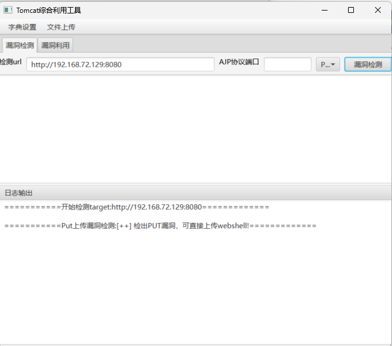
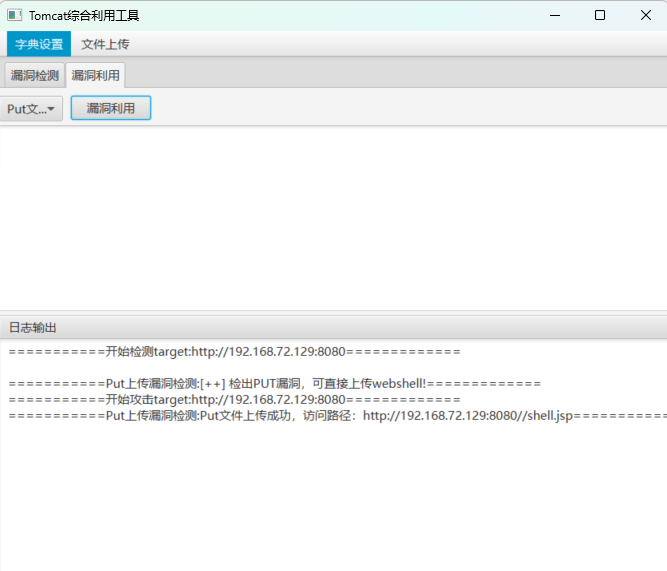
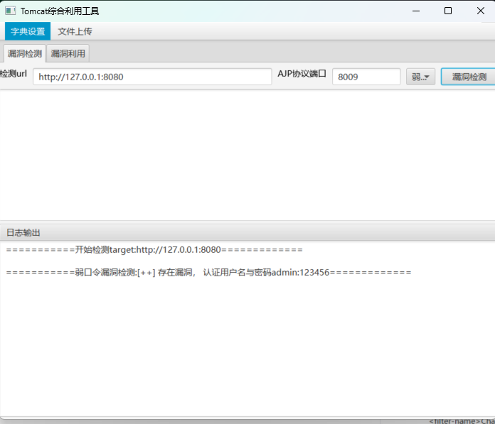
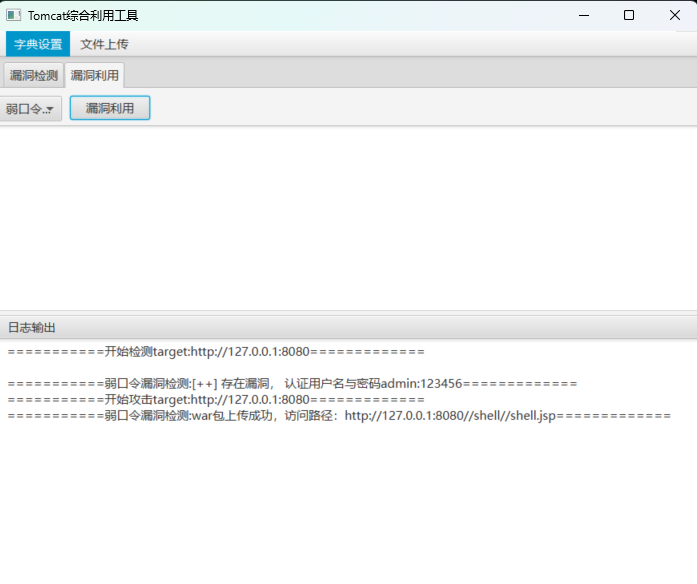

# TomcatVuln
综合Tomcat常见nday自动化漏洞检测以及利用工具
## 使用方式
工具需要在java8+，maven3.5+版本运行
1. 下载java、maven并且配置环境变量以及仓库
2. 运行TomcatAttackMain主函数
3. 工具仅支持单url测试
4. 可在Releases中运行jar包即java -jar TomcatVuln-1.0-SNAPSHOT.jar
5. 上传webshell以及war包默认提供冰蝎🐎，测试请做好免杀

## 效果图
### put文件上传

### ajp协议漏洞
默认读取web.xml文件，漏洞利用方式是通过web.xml文件读取其中的class文件到本地

### 弱口令漏洞

